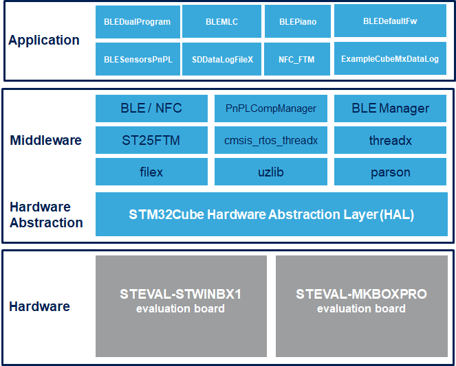

# FP-SNS-STBOX1 Firmware Package

The FP-SNS-STBOX1 is STM32Cube Function Pack for:
- SensorTile.box PRO discovery box with multi-sensors and wireless connectivity (STEVAL-MKBOXPRO) 
- STWIN.BOX Industrial Node Development Kit (STEVAL-STWINBX1) 
The purpose of this functional pack is to provide simple applications and examples that show how to build custom applications for STEVAL-MKBOXPRO Pro Mode and STEVAL-STWINBX1.

The expansion is built on STM32Cube software technology to ease portability across different STM32 microcontrollers.

**FP-SNS-STBOX1 software features**:

- Complete examples and applications to develop node with BLE connectivity, analog microphone, environmental and motion sensors, and perform real-time monitoring of sensors and audio data
- Example of how create one Boot Loader and one application for allowing Firmware Over the Air update
- Firmware compatible with ST BLE Sensor applications for Android/iOS, to perform sensor data reading, motion algorithm features demo and firmware update (FOTA)
- Easy portability across different MCU families, thanks to STM32Cube
- Free, user-friendly license terms

This firmware package includes Components Device Drivers, Board Support Package and example application for the:

- STMicroelectronics STEVAL-MKBOXPRO (SensorTile.box-Pro)  evaluation board that contains the following components:
  - MEMS sensor devices: STTS22H, LPS22DF, LSM6DSV16X, LIS2DU12, LIS2MDL
  - Dynamic NFC tag: ST25DV04K
  - Digital Microphone: MP23db01HP
  
- STMicroelectronics STEVAL-STWINBX1 (STWIN.BOX) evaluation board that contains the following components:
  - MEMS sensor devices: IIS2DLPC, IIS2MDC, IIS3DWB, ISM330DHCX,IIS2ICLX,ILPS22QS,STTS22H
  - analog/digital microphone 
  - ST25dv 64K
  - BlueNRG-2 Bluetooth Low Energy System On Chip

Here is the list of references to user documents:

- [DB4008: STM32Cube function pack for the Pro Mode of the SensorTile.box wireless multi sensor development kit ](https://www.st.com/resource/en/data_brief/fp-sns-STBOX1.pdf)
- [UM2626: Getting started with the STM32Cube function pack for the Pro Mode of the SensorTile.box wireless multi sensor development kit](https://www.st.com/resource/en/user_manual/um2626-getting-started-with-the-stm32cube-function-pack-for-the-pro-mode-of-the-sensortilebox-wireless-multi-sensor-development-kit-stmicroelectronics.pdf)
- [FP-SNS-STBOX1 Quick Start Guide](https://www.st.com/content/ccc/resource/sales_and_marketing/presentation/product_presentation/group0/5c/4e/96/c2/a6/98/4a/7f/FP-SNS-STBOX1_Quick_Start_Guide/files/FP-SNS-STBOX1_Quick_Start_Guide.pdf/jcr:content/translations/en.FP-SNS-STBOX1_Quick_Start_Guide.pdf)

## Supported Devices and Boards

- STEVAL-MKBOXPRO (SensorTile.box PRO) discovery box with multi-sensors and wireless connectivity for any intelligent IoT node\[[STEVAL-MKBOXPRO](https://www.st.com/en/evaluation-tools/steval-mkboxpro.html)\]
- STEVAL-STWINBX1 (STWIN.box) SensorTile Wireless Industrial Node Development Kit \[[STEVAL-STWINBX1](https://www.st.com/en/evaluation-tools/steval-mksbox1v1.html)\]

## Known Limitations

With some Android phones there are some compatibility issues for:

- using the PIN for BLE security connection (BLEDualProgram application). In this case disable the STBOX1_BLE_SECURE_CONNECTION on respective Inc/STBOX1_config.h file

- for forcing a full BLE rescan (BLEMLC). In this case disable the BLE_FORCE_RESCAN on their Inc/STBOX1_config.h files

In all these situations, before to connect to the SensorTile.box, each time you change the running application, clean the Device Cache for forcing a rescan of BLE services:

## Development Toolchains and Compilers

-   IAR Embedded Workbench for ARM (EWARM) toolchain V9.20.1 + STLink/V2 or STLink/V3
-   RealView Microcontroller Development Kit (MDK-ARM) toolchain V5.38.0 + ST-LINK/V2 or STLink/V3
-   Integrated Development Environment for STM32 (STM32CubeIDE) V1.15.1 + ST-LINK or STLink/V3
	
## Dependencies 

This software release is compatible with:

- [**ST BLE Sensor Android application**](https://play.google.com/store/apps/details?id=com.st.bluems)  V5.0.0 (or higher)
- [**ST BLE Sensor iOS application**](https://apps.apple.com/it/app/st-ble-sensor/id993670214)  V5.0.0 (or higher)
